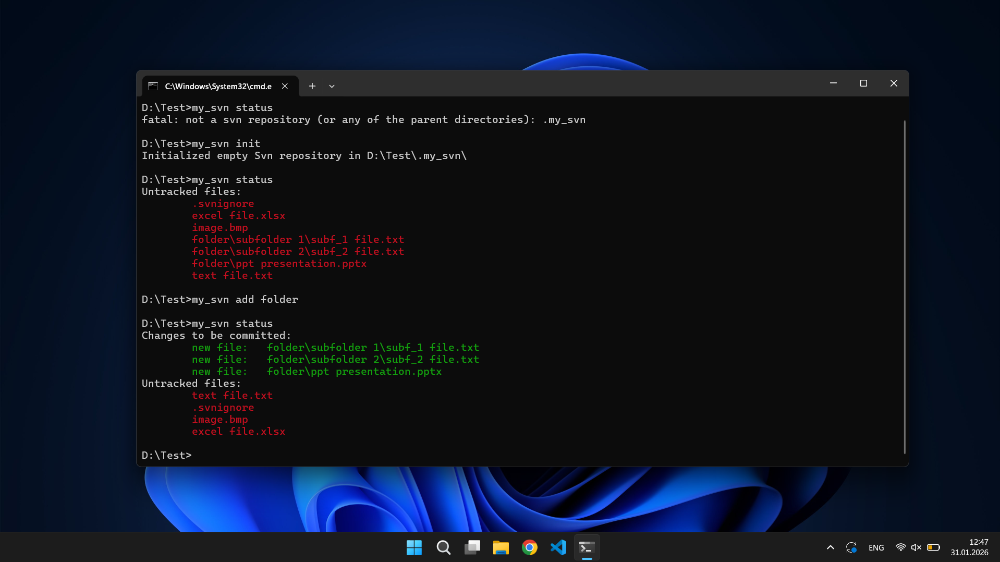
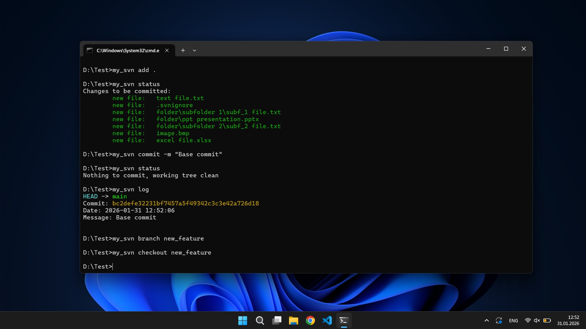
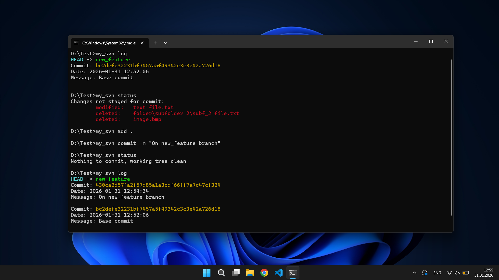
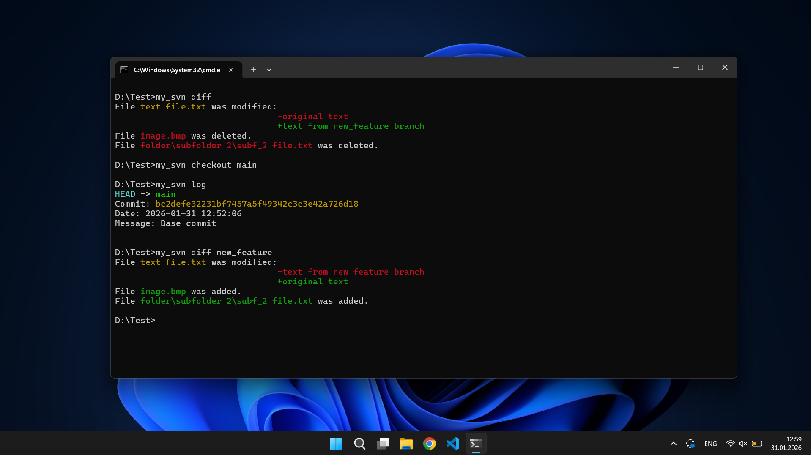
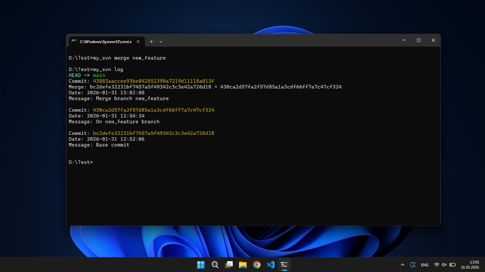
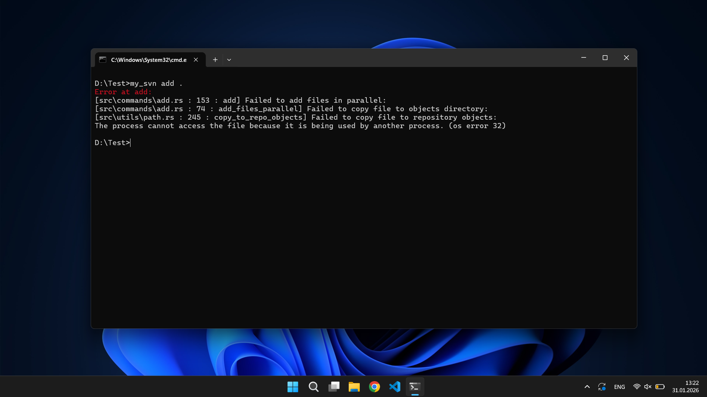

# My_SVN

A lightweight version control system written in Rust, inspired by Git, implementing the most used commands from Git.

## Screenshots
<table>
  <tr>
    <td align="center">
      <b>Init</b><br>
      
    </td>
    <td align="center">
      <b>Add</b><br>
      
    </td>
  </tr>
  <tr>
    <td align="center">
      <b>Branch</b><br>
      
    </td>
    <td align="center">
      <b>Diff</b><br>
      
    </td>
  </tr>
  <tr>
    <td align="center">
      <b>Merge</b><br>
      
    </td>
    <td align="center">
      <b>Error Management</b><br>
      
    </td>
  </tr>
</table>

## Features

- **Initialize Repository** - Create a new `.my_svn` repository
- **File Tracking** - Add and track files efficiently using SHA1 hashing
- **Commit Management** - Create snapshots of the project with custom messages
- **Branching** - Create and manage multiple branches for parallel development
- **Checkout** - Switch between branches
- **Merge** - Merge branches with automatic conflict detection
- **Status** - View the current state of your repository
- **Diff** - Compare file changes between commits and branches
- **Log** - View complete commit history with timestamps
- **Index System** - Staging area for managing file states
- **Ignore Rules** - Support for `.svnignore` files to exclude files from tracking
- **Parallel Processing** - Optimized file operations using multi-threading with Rayon

## Download the executable: [HERE](https://github.com/AndreiGhiorghies/My_SVN/releases/download/v1/my_svn.exe)

## Usage

You should be in the same directory with the executable to run the commands. If you want to run it from anywhere, add the executable to your PATH environment variables (Windows).

The app supports finding the repository in parent directories.

### Initialize a Repository
```bash
my_svn init
```

### Add Files
```bash
# Add specific files
my_svn add src/main.rs Cargo.toml

# Add all files in current directory
my_svn add .
```

### Commit Changes
```bash
my_svn commit -m "Your commit message"
```

### Branch Management
```bash
# Create a new branch
my_svn branch new_feature

# Checkout to a branch
my_svn checkout new_feature

# View commit history
my_svn log
```

### Merge Branches
```bash
my_svn merge new_feature
```

### Check Status
```bash
my_svn status
```

### View Differences
```bash
# Show diff with previous commit
my_svn diff

# Show diff with specific branch
my_svn diff <branch-name>
```

### Print available commands
```bash
my_svn help
```

## Key Implementation Details

### Architecture
- **Modular Design**: Separate command modules for each operation
- **Error Handling**: Comprehensive error handling with context information
- **Parallel Processing**: Uses Rayon for efficient file operations
- **Hashing**: SHA1-based content addressing for deduplication
- **Optimization for hashing**: check the last timestamp from when the file was modified and calculate the hash only if the file was modified from the last save
- **Ignore Rules**: Pattern-based file exclusion (glob patterns supported)

### Internal Storage Structure
- `.my_svn/` - Repository metadata directory
  - `objects/` - Stores file and commit objects
  - `refs/heads/` - Branch references
  - `HEAD` - Current branch pointer
  - `index` - Staging area (JSON format)

## License

Open-source project under the MIT license.
